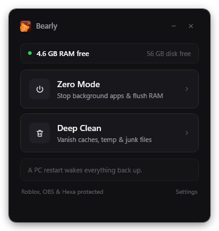

<div align="center">


# Bearly

**One-click Zero Mode & Deep Clean for Windows.**  
*Quiet your PC down to 0% CPU & maximum free RAM. A simple restart brings everything back.*

[](https://github.com/ZamilBinOfficial/bearly)
[](https://github.com/ZamilBinOfficial/bearly)
[](LICENSE)

<br/>



</div>

---

## ⚡ What is Bearly?

When coding, developing, or running heavy local workflows (Docker, Node.js, Python servers, AI models, browsers with dozens of tabs, background updaters), your PC gets bogged down with lingering background services, orphan tasks, and cached RAM.

**Bearly** solves this in a single click:
1. **Zero Mode**: Safely halts non-essential background processes, dev servers, and heavy telemetry services, then performs low-level RAM trimming (`NtSetSystemInformation` + `EmptyWorkingSet`).
2. **Deep Clean**: Vanishes temporary caches, shader caches, browser caches, Windows update remnants, and crash logs across the system.
3. **Safe by Design**: Never makes permanent system alterations. Essential system processes, drivers, and protected apps (Roblox, OBS Studio, Hexa) remain untouched. Restarting your PC restores all background services to their normal state.

---

## ✨ Features

* **Instant Zero State**: Drops idle CPU usage down to 0-1% and releases gigabytes of held RAM.
* **Minimalist Boutique UI**: Hand-crafted executive dark interface inspired by Raycast and Linear. Zero neon, zero clutter, zero bloat.
* **Live Resource Monitor**: Glanceable, real-time indicator of free memory and disk space.
* **UAC-Free Daily Launch**: Registers a secure scheduled task on setup so daily launches happen instantly without annoying UAC permission prompts.
* **Fully Configurable**: All targeted and protected processes/services are managed via a simple [`config.json`](config.json).

---

## 🚀 Quick Start & Installation

### Option 1: One-Click Setup (Recommended)
1. Download or clone this repository:
   ```bash
   git clone https://github.com/ZamilBinOfficial/bearly.git
   ```
2. Open the folder and double-click **`Install.bat`**.
3. Accept the Administrator prompt once. 
4. A **Bearly** shortcut with custom icon will be created on your **Desktop**.

### Option 2: Portable Run
Run directly via PowerShell:
```powershell
powershell -NoProfile -ExecutionPolicy Bypass -File .\Bearly.ps1
```

---

## 🛠️ Architecture

* **UI Layer**: Native Windows Presentation Framework (WPF) with pure XAML styling and high-DPI hardware acceleration.
* **Core Interop Engine (`core/BearlyCore.cs`)**: C# 5-compatible native interop utilizing `ntdll.dll` and `psapi.dll` for high-speed process enumeration, privilege escalation (`SeIncreaseQuotaPrivilege`), and system memory working-set purging.
* **Elevation Wrapper**: Silent VBScript and scheduled task triggers for zero console window flash.

---

## 🔒 Protected Applications

By default, Bearly will **never** terminate:
* Windows core kernel and security services
* Roblox / Roblox Studio
* OBS Studio (Streaming / Recording)
* Hexa / Voice tools

You can customize the whitelist anytime in [`config.json`](config.json).

---

## 📄 License

MIT License © 2026 [Zamil](https://github.com/ZamilBinOfficial).
